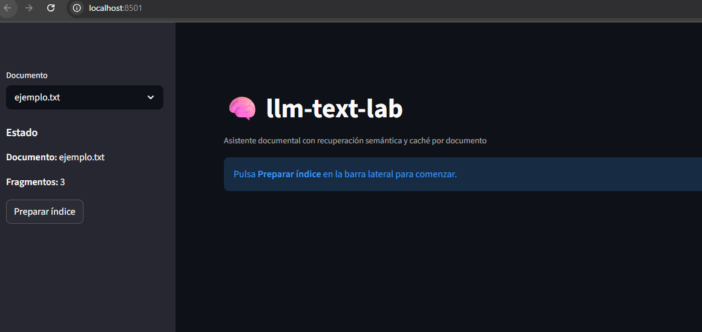
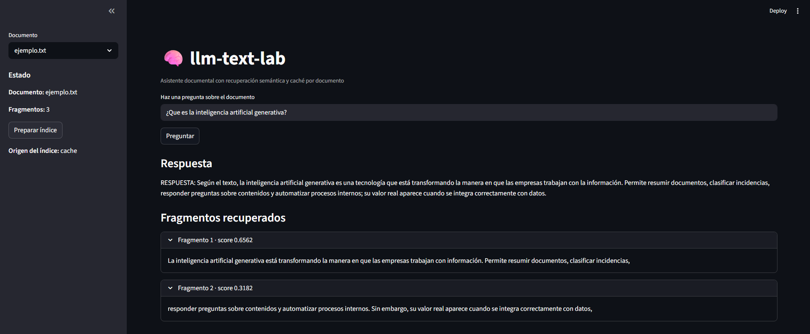
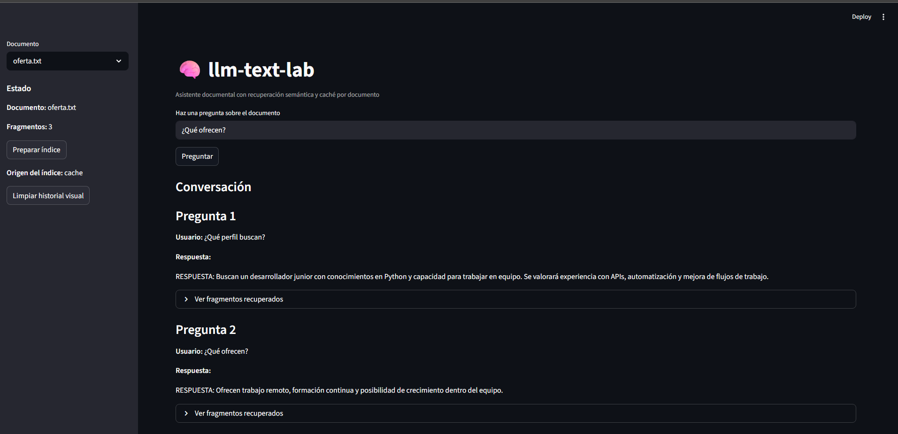
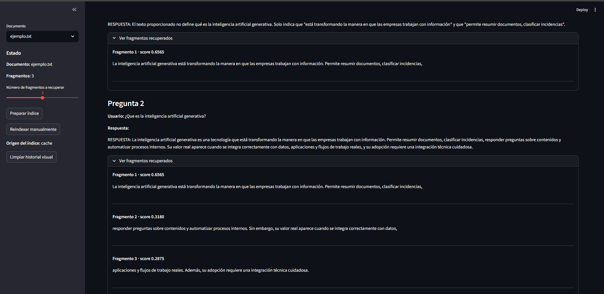

# llm-text-lab

Laboratorio de aprendizaje en Python para construir una herramienta de análisis documental con LLMs, recuperación semántica, caché vectorial y memoria conversacional básica.

## Descripción

`llm-text-lab` es un proyecto de consola orientado al aprendizaje progresivo de conceptos clave en aplicaciones con modelos de lenguaje.

El proyecto permite trabajar con documentos `.txt`, fragmentarlos, generar embeddings, recuperar fragmentos por similitud semántica y responder preguntas sobre su contenido usando la API de OpenAI.


Además, incluye varias mejoras propias de una herramienta más realista:

- selección de documentos
- caché vectorial persistente por archivo
- validación de caché mediante hash
- historial de sesión
- exportación del historial
- memoria conversacional reciente en preguntas encadenadas
- interfaz visual inicial con Streamlit

## Funcionalidades actuales

- Selección de documentos desde la carpeta `data/`
- División automática del texto en fragmentos
- Modos de análisis:
  - `resumen`
  - `puntos_clave`
  - `clasificacion`
  - `tono`
  - `todos`
- Modo `pregunta_semantica` con:
  - recuperación por similitud semántica
  - múltiples preguntas seguidas sobre el mismo documento
  - memoria conversacional reciente
- Caché vectorial por documento en `cache/`
- Validación de caché mediante hash del documento
- Historial de sesión en memoria
- Exportación del historial a `exports/`
- Menú principal persistente
- Cambio de documento sin reiniciar el programa
- Reintentos y validaciones básicas para entradas erróneas
- Control del número de fragmentos recuperados (`top_k`)
- Reindexado manual desde la interfaz
- Visualización de fragmentos del documento

- Separación modular de responsabilidades:
  - análisis
  - chat semántico
  - historial

## Estructura del proyecto

```text
llm-text-lab/
│
├── app/
│   ├── analysis.py
│   ├── chat.py
│   ├── config.py
│   ├── embeddings.py
│   ├── history.py
│   ├── main.py
│   ├── prompts.py
│   ├── utils.py
│   ├── streamlit_app.py
│   └── __init__.py
│
├── data/
│   ├── ejemplo.txt
│   └── oferta.txt
│
├── cache/          # ignorado por Git
├── exports/        # ignorado por Git
├── .env            # ignorado por Git
├── .gitignore
├── README.md
└── requirements.txt
```

## Requisitos

Para ejecutar el proyecto necesitas:

- Python 3.11 o superior
- Una cuenta con acceso a OpenAI API
- Una API key válida de OpenAI
- Dependencias instaladas desde `requirements.txt`

## Configuración

Crea un archivo `.env` en la raíz del proyecto con este contenido:

```env
OPENAI_API_KEY=tu_clave_aqui
```

## Instalación

### 1. Crear entorno virtual

```bash
python -m venv .venv
```

### 2. Activar entorno virtual en Windows

```bash
.venv\Scripts\activate
```

### 3. Instalar dependencias

```bash
pip install -r requirements.txt
```

## Ejecución

```bash
python -m app.main
```
## Ejecución - app visual 

```bash
python -m streamlit run app/streamlit_app.py
```

## Flujo de uso

1. Seleccionar un documento de la carpeta `data/`
2. Cargar o generar su índice vectorial
3. Elegir una opción del menú:
   - análisis por modo
   - pregunta semántica
   - ver historial
   - guardar historial
   - cambiar documento
   - salir
4. Trabajar de forma interactiva durante la sesión

## Ejemplos de uso

### Preguntas semánticas

Algunas preguntas que puedes hacer sobre `oferta.txt`:

- `¿Qué perfil buscan?`
- `¿Qué ofrecen a la persona contratada?`
- `¿Qué más se valora?`

### Análisis por modo

También puedes ejecutar análisis como:

- `resumen`
- `clasificacion`
- `tono`
- `todos`

sobre un fragmento concreto o sobre todos los fragmentos del documento.

## Conceptos aplicados

Este proyecto sirve como práctica progresiva de:

- uso de APIs de LLM
- prompt engineering
- fragmentación de documentos
- embeddings
- similitud coseno
- recuperación semántica
- caché persistente
- invalidación de caché por hash
- memoria conversacional básica
- historial de sesión
- exportación de resultados

## Salidas generadas por el programa

### Caché vectorial
Se guarda automáticamente en la carpeta:

```text
cache/
```

Se genera un archivo JSON por documento, por ejemplo:

```text
cache/ejemplo_indice_vectorial.json
cache/oferta_indice_vectorial.json
```

### Historial exportado
Se guarda automáticamente en la carpeta:

```text
exports/
```

Por ejemplo:

```text
exports/oferta_historial.txt
```

## Notas

- La carpeta `cache/` contiene índices generados automáticamente y no se versiona.
- La carpeta `exports/` contiene historiales exportados y no se versiona.
- El archivo `.env` contiene información sensible y no debe subirse a GitHub.
- El proyecto está pensado como laboratorio de aprendizaje y evolución incremental, no como producto final cerrado.

## Capturas

### Interfaz principal


### Pregunta sobre documento


### Interfaz Streamlit




## Posibles mejoras futuras

- interfaz gráfica o web
- soporte para PDF u otros formatos
- almacenamiento más eficiente del índice vectorial
- base de datos vectorial real
- filtros más avanzados de recuperación
- separación de historial por documento
- evaluación de respuestas y calidad de recuperación
